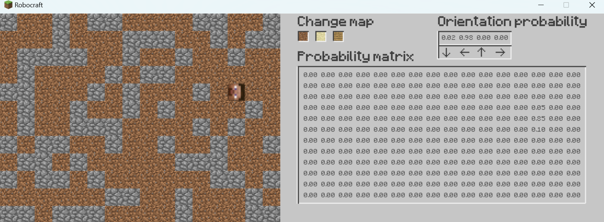
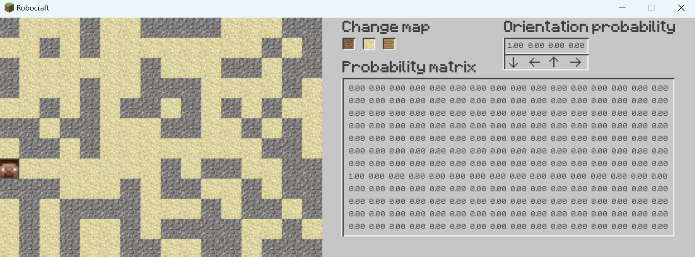
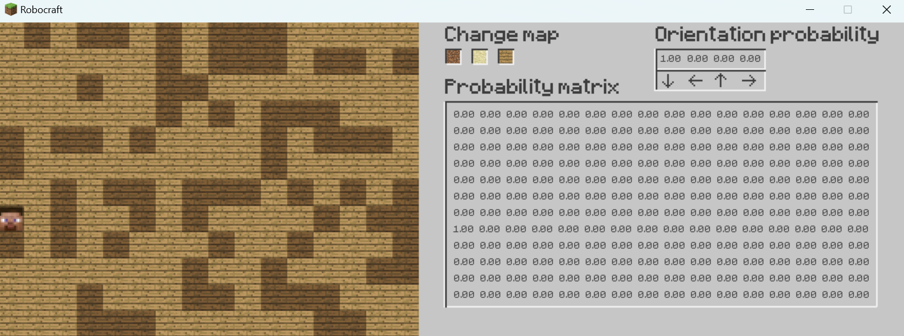

### 2d Bayesian localization

Here is implementation of 2d localization on discrete map. There is probability map that describes your location. Each step you can move, turn around or sense the block under you. It is important to consider that the sensor is not perfect and your movements are not perfect either. It may be that the sensor do not work correctly or that after pressing the key you do not move in the expected direction. In this case the probability of accurate localization decreases. There are 3 maps with different textures: cave, sand and wood. 

### Control:
- `SPACE` - move and the sense 5 times under you
- `LEFT`  - turn left
- `RIGHT` - turn right
- `M`     - move (without sensing)
- `S`     - sense (without moving)

### Examples:

### Have fun!
